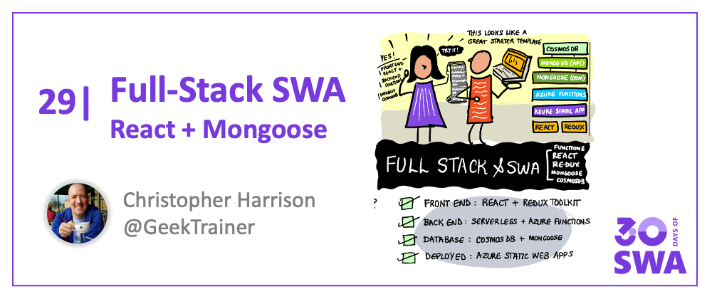

<head>
  <meta name="twitter:url" content="https://www.azurestaticwebapps.dev/blog/practices-full-stack-react" />
  <meta name="twitter:title" content="#27: Video Conferencing with ACS & SWA" />
  <meta name="twitter:description" content="Join @GeekTrainer on #30DaysOfSWA as he builds a full-stack @Reactjs app with @AzureStatic Apps @AzureFunctions @AzureCosmosDB & @mongoosejs !" />
  <meta name="twitter:image" content="https://www.azurestaticwebapps.dev/assets/images/28-banner.png" />
  <meta name="twitter:card" content="summary_large_image" />
  <meta name="twitter:creator" content="@nitya" />
  <meta name="twitter:site" content="@AzureStaticApps" /> 
  <link rel="canonical" href="https://www.azurestaticwebapps.dev/blog/practices-full-stack-react" />
</head>

Welcome to `Week 4, Day 7` of **#30DaysOfSWA**!!

We're at the last post of the series, so let's close the loop to where we started on Day 1. We started by talking about End-to-End Developer Experiences built on Azure Static Web Apps - and continued with a series of posts exploring various Azure service integrations that showcase this vision. Wouldn't it be great if you could have one end-to-end development example that you could use as a **starter** for your next prototype? Let's end this week with the perfect example. Today we'll look at an end-to-end developer workflow for a full-stack app:

- Front-end built with [React](https://reactjs.org/) and [Redux Toolkit](https://redux-toolkit.js.org/)
- Back-end built with [Azure Functions](https://docs.microsoft.com/azure/static-web-apps/add-api?tabs=vanilla-javascript)
- Deployed to the cloud with [Azure Static Web Apps](https://docs.microsoft.com/en-us/azure/static-web-apps/)
- With a [MongoDB database hosted in Cosmos DB](https://docs.microsoft.com/azure/cosmos-db/mongodb/mongodb-introduction), accessed using [Mongoose](https://mongoosejs.com/)
- (Optionally, with Playwright testing)

## What We'll Cover

- Building a Full-Stack App
- Why use Mongoose?
- Why use Redux Toolkit?
- **Build**: Implement and deploy the React/Mongoose template
- **Exercise**: Add your own features

## Building a Full-Stack App with SWA

In the first week of this series, we looked [Building Static Web Apps](./2022-05-03.md) using an **existing starter template** and learned about options for working with Azure Static Web Apps:
 1. [using VS Code](https://docs.microsoft.com/en-us/azure/static-web-apps/getting-started?tabs=react) - if you prefer an IDE
 2. [using Azure CLI](https://docs.microsoft.com/en-us/azure/static-web-apps/get-started-cli?tabs=react) - if you prefer the command-line
 3. [using Azure Portal](https://docs.microsoft.com/en-us/azure/static-web-apps/get-started-portal?tabs=react&pivots=github) - if you prefer a browser-based workflow 
 4. [using Azure Static Web Apps CLI](https://azure.github.io/static-web-apps-cli/docs/use/install) - if you prefer a unified develop-deploy tool

The default starter templates (for vanillaJS, React, Angular, Blazor, Vue) use a simple **front-end application** to validate your local development setup, and familiarize you with the automated build/deploy workflow setup by Azure Static Web Apps. 

Today we'll look at something different - a [mongoose-starter](https://github.com/staticwebdev/mongoose-starter) template for building a **full-stack application** with a React/Redux front-end, a serverless back-end (using Azure Functions) and a NoSQL database (using Azure CosmosDB API for MongoDB) that works seamlessly with the popular mongoose client. 

Learn more about creating full-stack apps using this technology stack, in this video:

<iframe src="https://learn-video.azurefd.net/vod/player?show=azure-tips-and-tricks-static-web-apps&ep=create-javascript-serverless-apps-w-azure-static-web-apps-etc-14-of-16--azure-tips-and-tricks" width="600" height="400"  frameborder="0"  allowfullscreen></iframe>

## Why use Mongoose?

When accessing a data store you can either use APIs to interact directly with the backend or use a library which can provide additional functionality. Many developers prefer to use a library as it allows them to focus more on creating their code and logic while offloading some of the work. Mongoose is just such a library.

[Mongoose](https://mongoosejs.com/) is an Object-Database-Mapper (ODM) which allows you to define the objects you need to store in a NoSQL database. Mongoose can be used with any database which supports MongoDB APIs, which [Cosmos DB does](https://docs.microsoft.com/azure/cosmos-db/mongodb/mongodb-introduction). With Mongoose you can create schemas for your data, enforce validation, and streamline the process of interacting with your data.

## Why use Redux Toolkit?

[Redux](https://redux.js.org/) is the most popular tool for managing state in a [React](https://reactjs.org/) application. [Redux Toolkit](https://redux-toolkit.js.org/) helps create projects which use Redux by providing an additional framework for some of the most common tasks when using Redux. Redux Toolkit includes functions to streamline the process of creating reducers and updating and accessing state.

## Quickstart: Using the React/Mongoose template

To help jump start your development process, we'll [use the mongoose-starter template](https://github.com/staticwebdev/mongoose-starter) built on the following libraries and tools:

- React
- Redux Toolkit
- Mongoose
- [Node-config](https://github.com/node-config/node-config#readme)
- SWA CLI

The template is a todo application and contains models for items and lists (which contain the items). It uses [GitHub authentication through Azure Static Web Apps](https://docs.microsoft.com/azure/static-web-apps/authentication-authorization?tabs=invitations). To support local development, a `devcontainer.json` file is included [use a dev container](https://code.visualstudio.com/docs/remote/containers).

Follow **[this tutorial](https://docs.microsoft.com/azure/static-web-apps/add-mongoose)** to build and deploy the full-stack application to Azure Static Web Apps by completing the following steps:

- create the Cosmos DB server
- create a new repository from the template
- create the Azure Static Web App
- configure the Azure Static Web App
- use the site

**Watch this segment** to walk interactively through the process of using the mongoose-starter template build/deploy the basic project to Azure Static Web Apps.
<iframe src="https://learn-video.azurefd.net/vod/player?show=azure-tips-and-tricks-static-web-apps&ep=how-to-create-your-azure-static-web-apps-from-a-github-template-15-of-16--azure-tips-and-tricks" width="600" height="400"  frameborder="0"  allowfullscreen></iframe>

**And watch this segment** to learn how you can setup and configure your Azure CosmosDB resource to work with your Azure Static Web Apps deployment.

<iframe src="https://learn-video.azurefd.net/vod/player?show=azure-tips-and-tricks-static-web-apps&ep=setup-cosmos-db-w-a-mongodb-api-to-use-w-azure-static-web-apps-16-of-16--azure-tips--tricks" width="600" height="400"  frameborder="0"  allowfullscreen></iframe>

## Exercise: Add your own features

The template is designed to be used as the starter for your own projects. 

To build upon what you've learned, you could **explore expanding the functionality** by adding your own features. Clone the repository you created and begin writing your own code! This could include:
 * allowing items to be labeled
 * implementing archive functionality
 * potentially incorporating [artificial intelligence to detect the sentiment of tasks](https://docs.microsoft.com/azure/cognitive-services/language-service/sentiment-opinion-mining/quickstart?pivots=programming-language-javascript).

Alternatively, use what you learned to add CosmosDB as a database for an application built using a different front-end framework  - try one of the usage examples from Week 2, or enhance something you've already built.

## Resources

Here is a collection of resources you may find helpful for digging more into creating applications hosted on Azure Static Web Apps:

- SWA Quickstart: [Using Azure CLI](https://docs.microsoft.com/azure/static-web-apps/get-started-cli?tabs=react)
- [Official Tutorial: Intro to React](https://reactjs.org/tutorial/tutorial.html)
- [Creating your first web apps with React](https://docs.microsoft.com/learn/paths/react/) - on Microsoft Learn
- [Web Dev For Beginners](https://github.com/microsoft/Web-Dev-For-Beginners) - project-based curriculum

